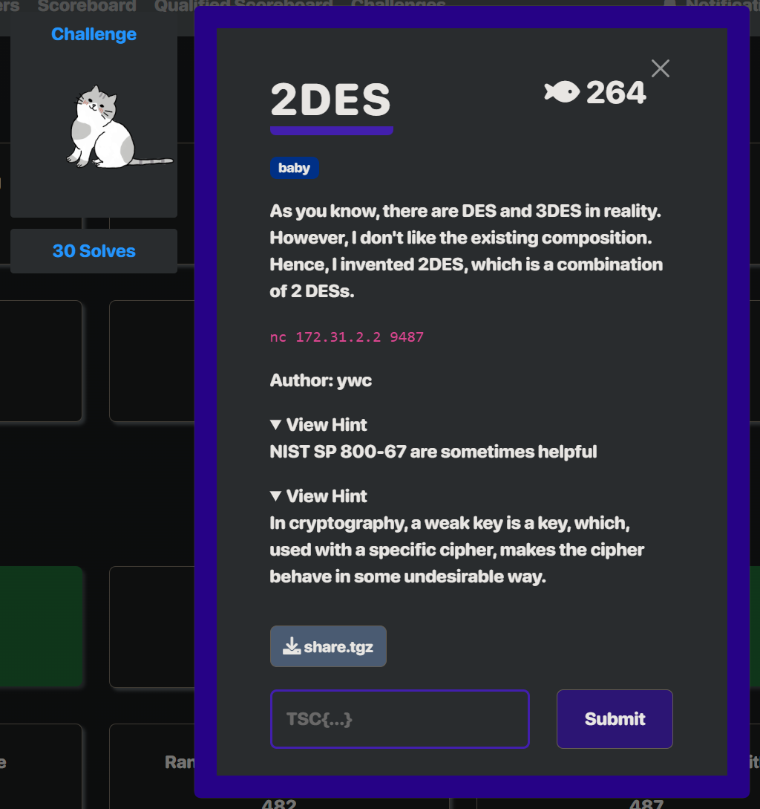

# crypto - 2DES Writeup

---  

## FLAG：
`TSC{th3_Key_t0_br34k_DES_15_tHe_keY}`

## 觀察：
- 從三把key中隨機取一把key1，使用者輸入key2，server分別用key1與key2執行一次DES加密，目標使最終ciphertext與plaintext相同。

## 思路：
- 題目的key1，搜尋可以發現是 semi-weak key，`1FE01FE00EF10EF1`-`E01FE01FF10EF10E`為一組key pair，即用這兩個key各加密一次會得到原本的ciphertext。

## 步驟：
1. 發送Encrypt flag請求，並輸入key2為`E01FE01FF10EF10E`，直到取得flag。