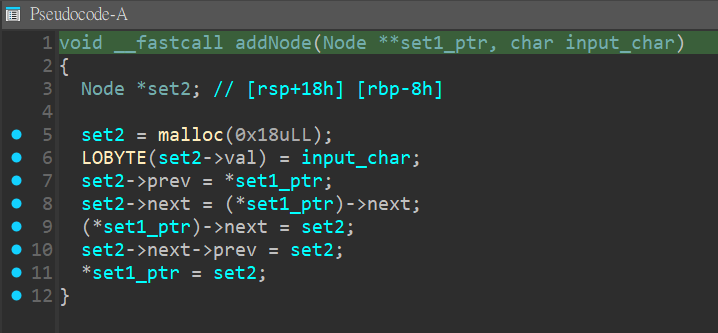
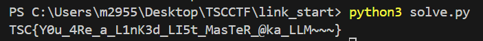

# rev - link_start Writeup

---  


## FLAG：
`TSC{Y0u_4Re_a_L1nK3d_LI5t_MasTeR_@ka_LLM~~~}`

## 觀察：
- 執行檔案：使用者輸入、檢查FLAG。
- IDA分析：
	- `main()`：
	  
	- `addNode()`：
	  
	- `popNode()`：
	  
	  

## 思路：
- `main()`裡有兩個function，對一個整數與兩個pointer進行操作，且0x12C5這個function有個明顯的刪除節點的行為，判斷整體的資料結構為doubly linked list。
- `main()`會 pop 4 個 node，xor後再以不同的順序insert回去；每4個node執行一次。最後比對結果。

## 步驟：
1. 將比對結果逆推回flag。

## Exploit：  

```python
rst =[0x3B, 0x73, 0x44, 0x73, 0x1F, 0x10, 0x49, 0x45, 0x1F, 0x72,
        0x24, 0x55, 0x71, 0x7F, 0x71, 0x7C, 0x24, 0x6B, 0x7E, 0x03,
        0x75, 0x6C, 0x4F, 0x79, 0x21, 0x7F, 0x64, 0x7D, 0x12, 0x74,
        0x63, 0x55, 0x21, 0x60, 0x4F, 0x5B, 0x0D, 0x6C, 0x4F, 0x7C,
        0x3D, 0x5E, 0x6E, 0x4E]
flag = []
for i in range(0, len(rst), 4):
    flag.append(rst[i+2] ^ 0x10)
    flag.append(rst[i+1] ^ 0x20)
    flag.append(rst[i+3] ^ 0x30)
    flag.append(rst[i] ^ 0x40)
print(bytes(flag).decode())
```

